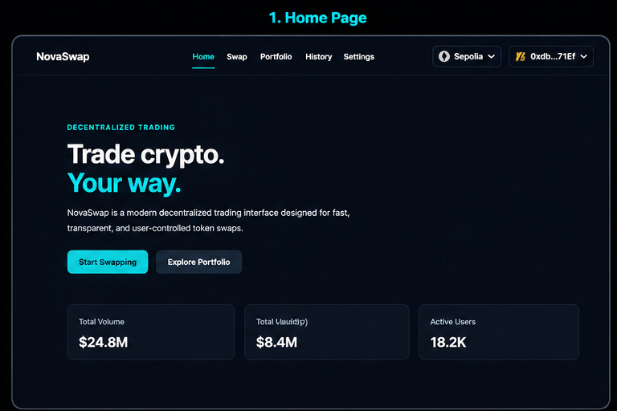
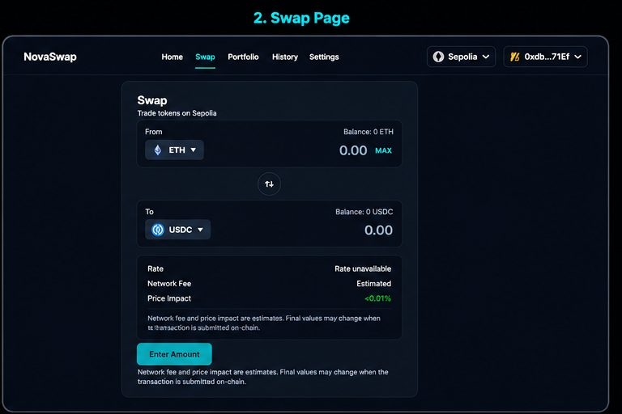
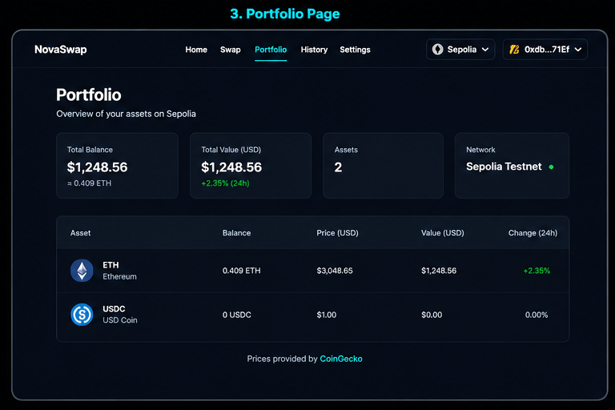
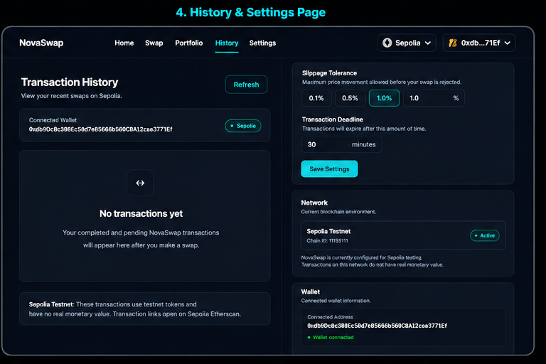

# NovaSwap

A Sepolia-based decentralized token swap application built with React, TypeScript, Wagmi, Viem, and Solidity.

## 🚀 Live Demo

https://novaswap.vercel.app/

## 📦 GitHub

https://github.com/Avikr11/novaswap

## ✨ Features

- 🔗 MetaMask wallet connection
- 🌐 Sepolia testnet support
- �� ETH ↔ USDC token swapping
- 📊 Real-time swap quotes from the router contract
- 🔐 ERC-20 token approval flow
- 🛡️ Slippage protection
- ⏱️ Configurable transaction deadline
- 💰 Live wallet balances
- 📈 Portfolio valuation using market prices
- 📜 Local swap transaction history
- ⚙️ Swap settings
- 📱 Responsive UI
- ✨ Framer Motion animations
- 🔔 Transaction and error states

## 🛠️ Tech Stack

### Frontend
- React
- TypeScript
- Vite
- Tailwind CSS
- Framer Motion

### Web3
- Wagmi
- Viem
- MetaMask
- Sepolia Testnet

### Smart Contracts
- Solidity
- Hardhat

### APIs
- CoinGecko

## ��️ Architecture

```text
React UI
   │
   ├── Wagmi / Viem
   │       │
   │       ▼
   │   Sepolia Network
   │       │
   │       ▼
   │   NovaSwapRouter
   │       │
   │       ├── ETH ↔ USDC
   │       ├── Quotes
   │       ├── Approvals
   │       └── Swaps
   │
   └── CoinGecko
           │
           ▼
      Market Prices

## 📸 Screenshots

### Home


### Swap


### Portfolio


### History & Settings

